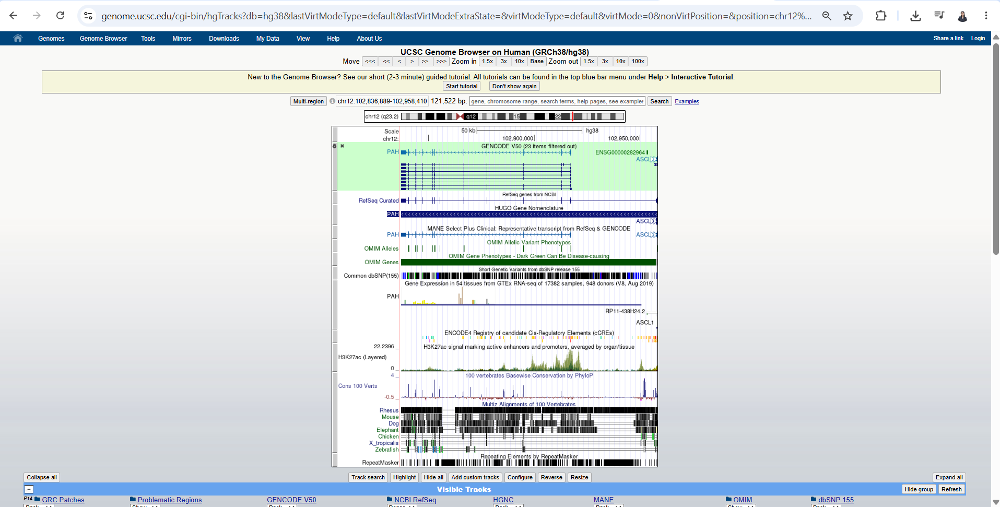
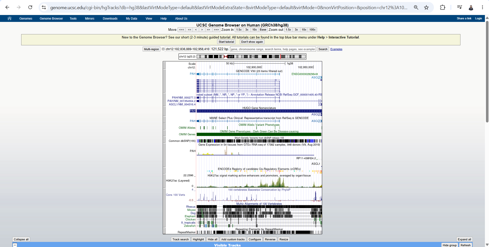
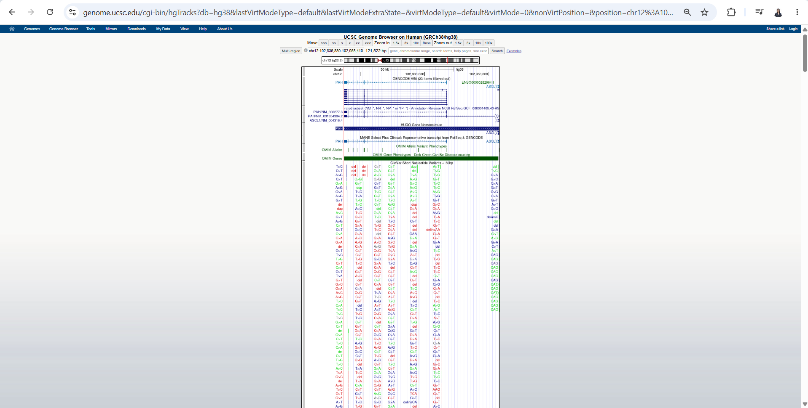
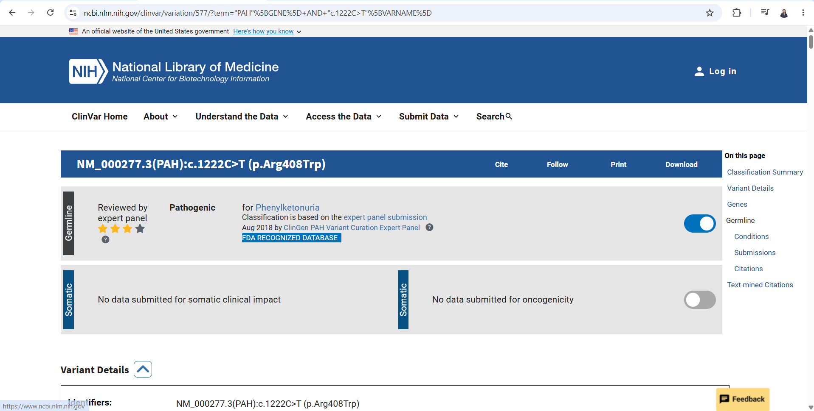
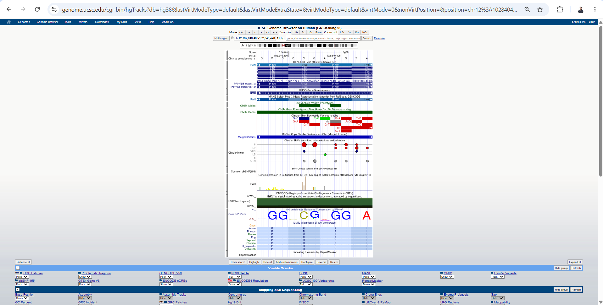

# Exploring the PAH Gene Using UCSC Genome Browser and NCBI ClinVar

**Name:** Kyla Rose D. Villegas  

**Assigned Gene:** PAH  

**Associated Disease:** Phenylketonuria (PKU)  

**Activity:** Exploring a Human Disease Gene Using UCSC Genome Browser and NCBI ClinVar

## 2. UCSC Gene Location

I opened the UCSC Genome Browser and selected the Human GRCh38/hg38 genome assembly. I searched for the PAH gene and opened the official human PAH gene locus.

- **Official gene symbol:** PAH
- **Full gene name:** Phenylalanine hydroxylase
- **Chromosome:** 12
- **Genome assembly:** GRCh38/hg38
- **Genomic coordinates:** chr12:102,836,889-102,958,410
- **DNA strand:** Minus (-) strand
- **Approximate gene size:** 121,522 bp (~121.5 kb)

### Screenshot 1 - PAH Gene Location

## 3. Exons, Introns, and Transcripts

- **Selected transcript:** NM_000277.3
- **Number of exons:** 13
- **Multiple transcripts/isoforms visible:** Yes

An exon is a region of a gene that remains in the mature RNA after splicing, while an intron is a region that is removed during RNA processing.

In the PAH gene, the introns generally appear much longer than the exons because the exon boxes are relatively short and are separated by long connecting intron regions.

### Screenshot 2 - PAH Gene Structure

## 4. UCSC Annotation Tracks

For the gene annotation, I used the **NCBI RefSeq** track. I also displayed the **ClinVar Variants** track and the **UCSC 100 Vertebrates** conservation track.

- **Gene annotation track used:** NCBI RefSeq
- **ClinVar-related variants visible:** Yes. Many ClinVar variant marks were visible within and near the PAH gene.
- **Were some regions more conserved than others?** Yes. The conservation signal varied across the PAH region, with some areas showing stronger conservation than others.
- **Where were the conserved regions located?** Stronger conservation was mainly seen around several exon-associated regions, although some conservation signal was also present outside the exons.

Strong conservation suggests that a DNA region has remained similar across different species over evolutionary time. This can indicate that the sequence has an important biological function because major changes in important regions may be less likely to be tolerated.

### Screenshot 3 - ClinVar and Conservation Tracks

## 5. Selected ClinVar Variant

- **Gene:** PAH
- **Variant/HGVS:** NM_000277.3(PAH):c.1222C>T (p.Arg408Trp)
- **ClinVar Variation ID:** 577
- **VCV accession:** VCV000000577.151
- **rsID:** rs5030858
- **Chromosome and genomic position (GRCh38):** chr12:102,840,493
- **Cytogenetic location:** 12q23.2
- **Associated condition:** Phenylketonuria
- **Clinical significance:** Pathogenic
- **Review status:** Reviewed by expert panel
- **ClinVar URL:** https://www.ncbi.nlm.nih.gov/clinvar/variation/577/

### Screenshot 4 - Selected ClinVar Variant

## 6. Locating the Variant in UCSC

I returned to the UCSC Genome Browser using the GRCh38/hg38 assembly and searched the genomic coordinate chr12:102,840,493 obtained from ClinVar. I zoomed in on the region and compared the ClinVar variant track with the NCBI RefSeq PAH gene model.

- **Selected variant:** NM_000277.3(PAH):c.1222C>T (p.Arg408Trp)
- **Genomic position:** chr12:102,840,493 (GRCh38)
- **Location relative to PAH:** The variant is located within the PAH gene.
- **Gene region:** Exon 12
- **Coding or non-coding:** Coding region
- **Variant consequence:** Missense variant
- **Protein change:** p.Arg408Trp (R408W)

The c.1222C>T variant changes the codon so that arginine at amino acid position 408 is replaced by tryptophan. Because the variant is located in a coding exon, this change can alter the amino acid sequence and potentially affect PAH protein structure and function.

Although ClinVar classifies this variant as pathogenic, additional evidence such as functional studies, patient genotype-phenotype data, segregation analysis, and other clinical evidence is useful when evaluating how a variant contributes to disease.

### Screenshot 5 - Selected Variant in UCSC

## 7. Reflection

### 1. What did UCSC show you about your gene that was not obvious from simply reading about the gene's function?

UCSC showed me the actual genomic organization of the PAH gene, including its exons, introns, transcript isoforms, and position on chromosome 12. It also showed how different genomic annotation tracks can be viewed together with the gene structure.

### 2. Why is knowing the exact genomic location of a disease-associated variant useful?

Knowing the exact genomic location makes it possible to determine where the variant occurs within a gene. It can help identify whether the variant is located in an exon, intron, UTR, splice region, or another genomic region and helps connect ClinVar information with the genome browser.

### 3. What is one limitation of predicting a variant's effect only from its genomic location?

Genomic location alone cannot fully determine how strongly a variant affects gene or protein function. Additional evidence such as functional experiments, clinical observations, segregation data, and other genetic studies is needed to understand its biological and clinical effects.

### 4. What was the most interesting feature you observed about your assigned gene?

The most interesting feature I observed was the large number of clinically reported variants within the PAH gene. I also found it interesting that the selected c.1222C>T variant could be located directly within a coding exon using UCSC and connected to the p.Arg408Trp protein change reported in ClinVar.

## 8. References and Links

- UCSC Genome Browser: https://genome.ucsc.edu/
- NCBI ClinVar: https://www.ncbi.nlm.nih.gov/clinvar/
- PAH ClinVar Variant Record: https://www.ncbi.nlm.nih.gov/clinvar/variation/577/
- NCBI Gene - PAH: https://www.ncbi.nlm.nih.gov/gene/5053

---

# UCSC Cell Browser Activity

## 1. Assigned Gene and Disease

**Assigned Gene:** PAH  
**Associated Disease:** Phenylketonuria (PKU)

## 2. Organ/Tissue Choice and Dataset Information
